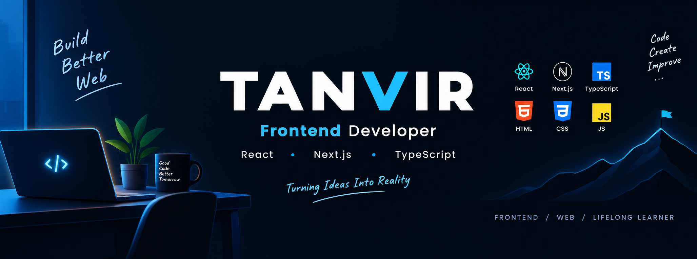

<!-- ===================== BANNER ===================== -->

  

<!-- ===================== INTRO ===================== -->

<h1 align="center">Hi 👋, I'm Tanvir</h1>

<h3 align="center">
  A passionate frontend developer from Bangladesh
</h3>

  

<!-- ===================== ABOUT ME ===================== -->

## 👨‍💻 About Me

- 🔭 I’m currently working on [Fitness Improving Website](http://mygyma.netlify.app/)
- 🌱 I’m currently learning **Next.js**
- 💬 Ask me about **React**
- 📫 How to reach me **mtanvir52562@gmail.com**
- ⚡ Fun fact: **Thinking about everything is programming**

<!-- ===================== SOCIALS ===================== -->

<h3 align="left">Connect with me:</h3>

  

<!-- ===================== LANGUAGES & TOOLS ===================== -->

<h3 align="left">Languages and Tools:</h3>

  

  

  

  

  

  

  

  

  

  

  

  

  

  

<!-- ===================== GITHUB STATS ===================== -->

<h3 align="left">📊 GitHub Stats:</h3>

  

  

  

